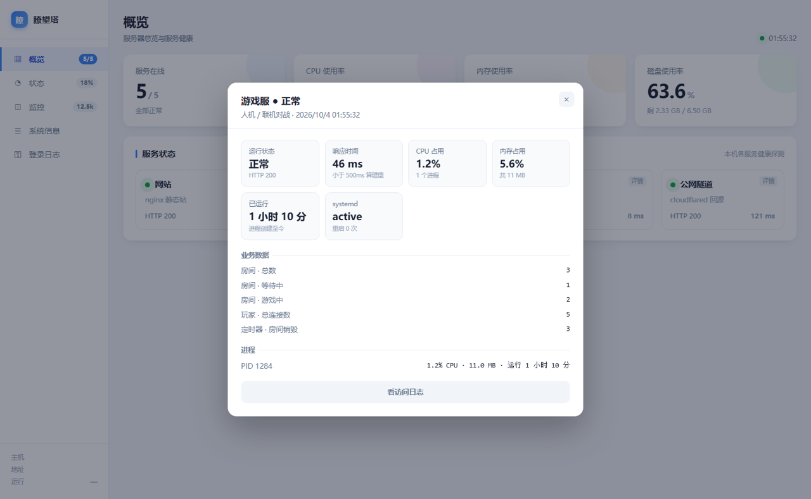
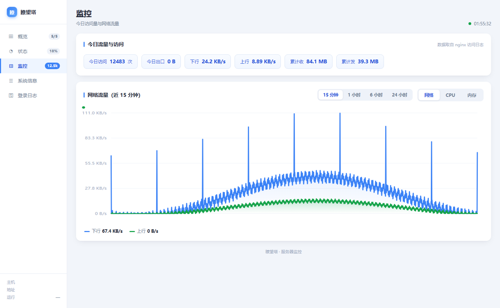
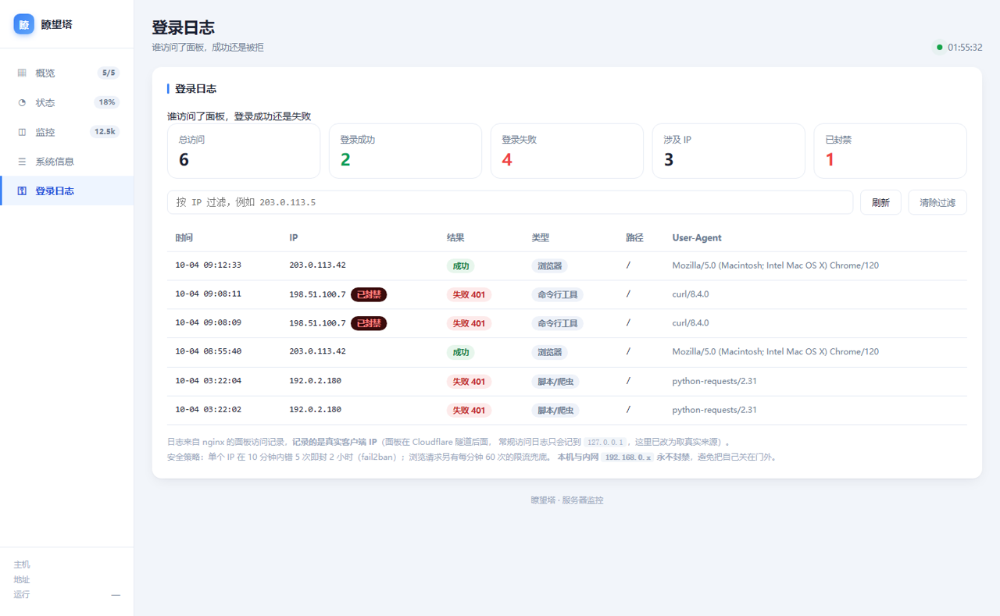

# 瞭望塔 · ppanel

一个**零依赖**的 Linux 服务器监控面板。单文件 Python（标准库）+ 单文件前端，
丢到服务器上 `python3 server.py` 就能跑，内存占用约 20 MB。

> 起因是 1Panel 太重（常驻 156 MB），换了个思路自己搓了一个 ——
> 结果越用越顺手，索性开源。


## 特性

| | |
|---|---|
| **零依赖** | 只用 Python 标准库，不需要 pip install 任何东西 |
| **低占用** | 常驻约 20 MB（1Panel 是 156 MB 的 1/8） |
| **单文件部署** | 两个文件：`server.py` + `index.html` |
| **多服务探活** | 并发探测，401/403 也算存活（说明服务在，只是要认证） |
| **告警引擎** | 服务不通 / 磁盘告急 / 内存过高 / 负载偏高 / CPU 持续高，带去抖与恢复通知 |
| **历史曲线** | 内存缓冲看秒级 + 落盘看 24 小时（自动轮转压缩） |
| **登录日志** | 记录**真实客户端 IP**（穿透 Cloudflare 隧道）+ 失败自动封禁 |
| **服务详情** | 点任意服务卡片，展开它的专属指标（见下） |

## 界面

<details open>
<summary><b>概览</b> — 四个关键指标 + 服务健康探测</summary>


</details>

<details>
<summary><b>服务详情</b> — 点任意卡片，展开它的专属指标与业务数据</summary>



</details>

<details>
<summary><b>监控</b> — 15 分钟 / 1 小时 / 6 小时 / 24 小时任意切换</summary>



</details>

<details>
<summary><b>登录日志</b> — 真实客户端 IP，失败自动封禁</summary>



</details>

## 快速开始

```bash
git clone https://github.com/peet2269/ppanel.git
cd ppanel

# 配一下要监控哪些服务（不配也能跑，有默认示例）
cp services.example.json config.json
vim config.json

python3 server.py
```

浏览器打开 `http://127.0.0.1:8090`。

## 配置

`config.json`（可选，全部字段都有默认值）：

```jsonc
{
  "services": [
    {
      "key": "web",              // 内部标识
      "name": "我的网站",         // 卡片上显示的名字
      "url": "http://127.0.0.1:80/",   // 探活地址
      "note": "nginx 静态站",     // 卡片小字
      "home": "https://example.com/",   // 有外链时弹层里给「打开站点」按钮
      "unit": "nginx",           // systemd 单元名，用于显示运行状态
      "proc": "nginx: worker process", // ps 里的匹配串，用于算 CPU/内存
      "api": null,               // 专属 API，会被解析成「业务数据」
      "log": "example-access"    // nginx 日志名（不含 .access.log），用于统计今日请求
    }
  ],
  "nginx_log": "/var/log/nginx/access.log",
  "nginx_error_log": "/var/log/nginx/error.log",
  "thresholds": {
    "disk_pct": 90,          // 磁盘使用率告警线
    "mem_pct": 92,
    "load_ratio": 1.6,       // load1 / 核数
    "cpu_sustained": 95,     // CPU 连续超这个值…
    "cpu_sustain_secs": 120  // …持续这么多秒才告警（避免尖峰误报）
  }
}
```

**`api` 字段是精髓**：填上服务自己的 API，面板会把它返回的 JSON
自动压成「业务数据」展示。比如填 `http://127.0.0.1:3000/stats`，
面板上就会多出一块显示 `房间数 / 在线人数 / 总连接数` 之类。

## 服务详情

点概览页任意服务卡片，弹层里会给：

- **通用指标** — 运行状态、响应时间、CPU、内存、已运行多久
  （systemd 单元 / 今日请求数有就显示）
- **业务数据** — 来自该服务自己的 `api`
- **进程明细** — 每个 PID 的 CPU / 内存 / 运行时长

`api` 返回的英文 key 会自动映射中文（`totalConnections` → 总连接数），
嵌套层里的 0 值会被隐藏（全是 0 看着像坏了，其实正常）。

## 安全建议

面板本身不做认证，**请务必放在 nginx 后面并加上认证**。

### 1. nginx 认证 + 限流

```nginx
# /etc/nginx/conf.d/panel-limit.conf
limit_req_zone $real_client_ip zone=panel_page:10m rate=60r/m;
```

```nginx
# 面板 server 块
auth_basic           "Restricted";
auth_basic_user_file /etc/nginx/.htpasswd;

# 面板在 Cloudflare 隧道后面时，$remote_addr 恒为 127.0.0.1，
# 真实客户端 IP 要从 CF-Connecting-IP 头取
set_real_ip_from 127.0.0.1;
real_ip_header CF-Connecting-IP;

limit_req zone=panel_page burst=40 nodelay;
limit_req_status 429;
```

### 2. 日志格式（拿真实 IP）

```nginx
# /etc/nginx/conf.d/panel-logformat.conf
log_format panel_auth '$time_iso8601|$status|$real_client_ip|'
                      '"$request_method $request_uri"|"$http_user_agent"|$request_time';
```

```nginx
access_log /var/log/nginx/panel-auth.log panel_auth;
```

面板的「登录日志」功能就是解析这个格式。

### 3. fail2ban 自动封禁

nginx 在 Basic Auth 失败时会在 **error log** 里记
`user "xxx": password mismatch, client: <IP>`，用官方过滤器即可：

```ini
# /etc/fail2ban/filter.d/panel-auth.conf
[Definition]
failregex = ^\s*\[error\] \d+#\d+: \*\d+ user "(?:[^"]+|.*?)":? (?:password mismatch|was not found in "[^\"]*"), client: (?P<ip>\S+), server: \S*, request: "\S+ \S+ HTTP/\d+\.\d+", host: "\S+"(?:, referrer: "\S+")?\s*$
ignoreregex =
```

```ini
# /etc/fail2ban/jail.d/panel-auth.local
[panel-auth]
enabled  = true
port     = http,https
filter   = panel-auth
logpath  = /var/log/nginx/your-panel.error.log
findtime = 600
maxretry = 5
bantime  = 7200
ignoreip = 127.0.0.1/8 ::1 192.168.0.0/24   # ★ 务必别把自己封了
backend  = auto
```

> ⚠️ **注意**：读的是 **error log** 不是 access log ——
> access log 里只有状态码 401，官方过滤器匹配不到。

### 4. 日志大小上限

```conf
# /etc/logrotate.d/panel-auth
/var/log/nginx/panel-auth.log {
    size 3M
    rotate 5
    compress
    delaycompress
    missingok
    notifempty
    create 0640 www-data adm
    postrotate
        [ -f /var/run/nginx.pid ] && kill -USR1 `cat /var/run/nginx.pid` 2>/dev/null || true
    endscript
}
```

## 开机自启

```ini
# /etc/systemd/system/ppanel.service
[Unit]
Description=ppanel 轻量服务器监控
After=network.target

[Service]
Type=simple
WorkingDirectory=/opt/ppanel
Environment=PANEL_PORT=8090
ExecStart=/usr/bin/python3 /opt/ppanel/server.py
Restart=always
RestartSec=3

[Install]
WantedBy=multi-user.target
```

```bash
systemctl enable --now ppanel
```

## 环境变量

| 变量 | 默认 | 说明 |
|---|---|---|
| `PANEL_PORT` | `8090` | 监听端口 |
| `PANEL_DATA` | `./data` | 落盘目录（历史曲线 + 告警流水） |
| `PANEL_CONFIG` | `./config.json` | 配置文件路径 |
| `PANEL_NGINX_LOG` | `/var/log/nginx/access.log` | 访问日志 |

## API

| 端点 | 说明 |
|---|---|
| `GET /api/stats` | 全量快照（CPU/内存/磁盘/网络/服务/今日统计） |
| `GET /api/history?range=15m\|1h\|6h\|24h` | 历史曲线；不带 range 走内存缓冲 |
| `GET /api/alerts` | 活跃告警 + 最近流水 + 当前阈值 |
| `GET /api/authlog?ip=&limit=` | 登录日志（结构化，含是否已封禁） |
| `GET /api/svc` | 所有服务的详情 |
| `GET /api/svc/<key>` | 单个服务详情 |

## 兼容性

- Linux（读 `/proc`，需要 root 或普通用户都可 —— 只读 `/proc` 不需要特权）
- Python 3.7+（用了 `subprocess.run`、`concurrent.futures`）
- 依赖 `curl` 命令（探活与取 API 用）

## License

MIT
